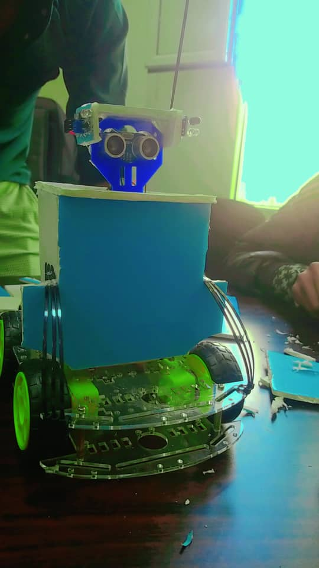
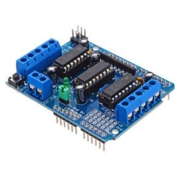
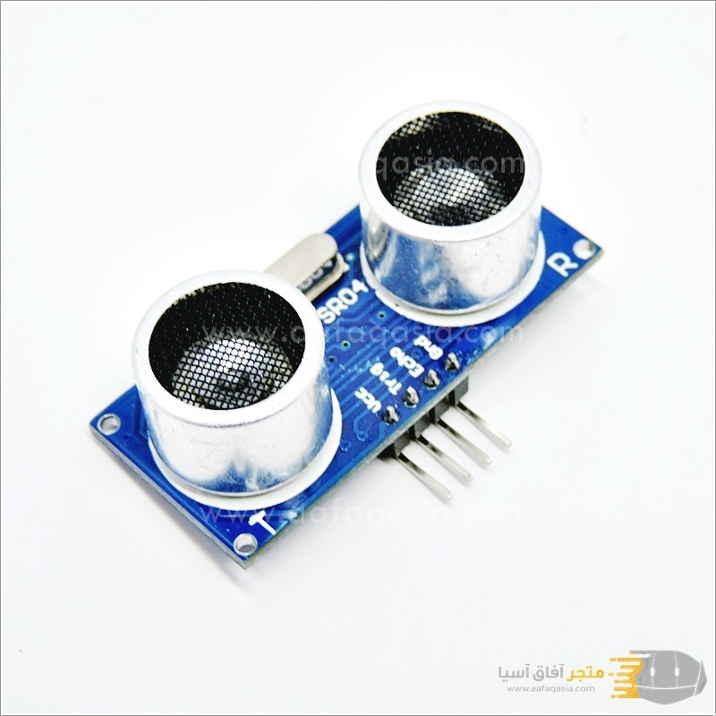
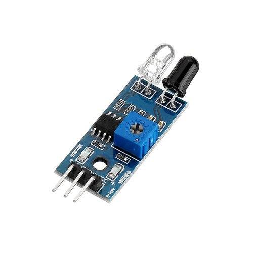
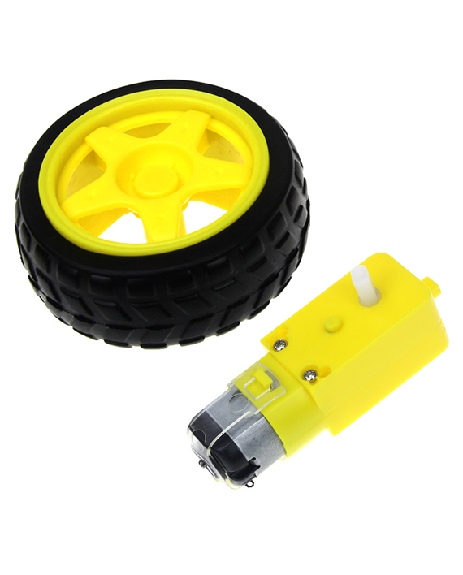
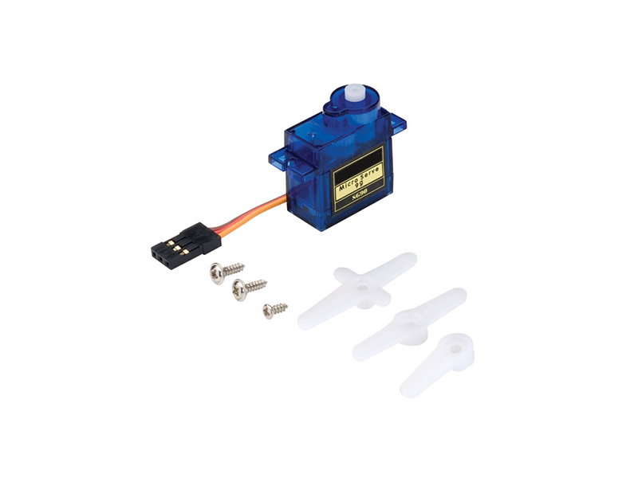
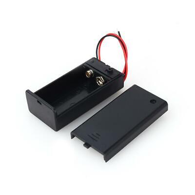
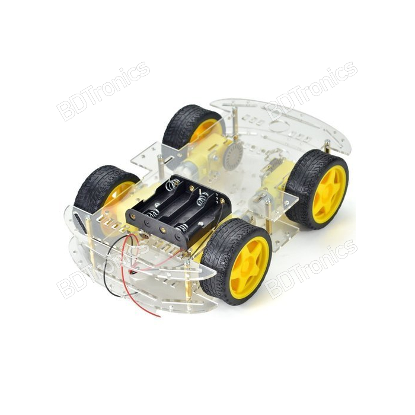
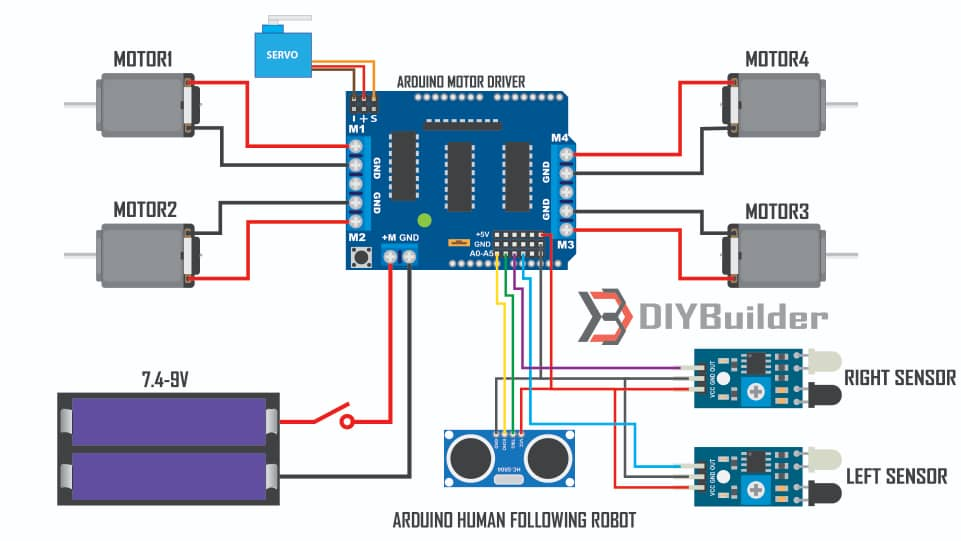

# 🤖 Human Follower Robot - روبوت تتبع الإنسان (Arduino)

<p align="center">
  
</p>

<p align="center">
  
  
  
</p>

## 📝 نظرة عامة

مشروع **روبوت تتبع الإنسان** هو نظام ذكي يعتمد على تقنيات استشعار متعددة لتتبع الأشخاص تلقائيًا. يتميز بقدرات تتبع دقيقة وسلاسة في الحركة، مما يجعله مثاليًا للمشاريع التعليمية أو التجريبية في عالم الروبوتات والذكاء الاصطناعي المدمج.

---

## ✨ المميزات الرئيسية

- 🎯 نظام تتبع ذكي باستخدام حساسات الموجات فوق الصوتية وIR
- ⚙️ تحكم كامل ودقيق في أربع محركات حركة
- 🔍 مسح محيطي بزاوية 180 درجة باستخدام محرك سيرفو
- 💰 تصميم بسيط بمكونات متوفرة وسهل التركيب

---

## 📦 قائمة المكونات

| المكون                        | الكمية | الصورة                                                                 | ملاحظات                        |
|------------------------------|--------|------------------------------------------------------------------------|--------------------------------|
| أردوينو أونو                 | 1      |                                               | لوحة التحكم الأساسية           |
| درايفر المحركات L293D       | 1      |                                | التحكم في 4 محركات             |
| حساس الموجات فوق الصوتية     | 1      |       | لقياس المسافات                 |
| حساسات الأشعة تحت الحمراء  | 2      |        | لتحديد اتجاه الحركة            |
| محركات DC مع عجلات          | 4      |                                          | قطر العجلات 6-8 سم             |
| محرك سيرفو SG90             | 1      |                                               | لتدوير حساس الموجات            |
| بطارية 9V + حامل            | 1      |                                        | مصدر طاقة متنقل                |
| هيكل الروبوت                | 1      |      | أي هيكل متوافق متاح            |

---

## 🔌 دائرة التوصيلات

<p align="center">
  
</p>

### التوصيلات التفصيلية:

#### حساس الموجات فوق الصوتية (HC-SR04)
- VCC → 5V  
- GND → GND  
- TRIG → A1  
- ECHO → A0  

#### حساسات IR:
- **الحساس الأيمن:** OUT → A2  
- **الحساس الأيسر:** OUT → A3  

#### المحركات:
- المحرك الأمامي الأيمن → M1  
- المحرك الأمامي الأيسر → M2  
- المحرك الخلفي الأيمن → M3  
- المحرك الخلفي الأيسر → M4  

#### محرك السيرفو:
- الإشارة → D10  
- VCC → 5V  
- GND → GND  

---

## 💻 البرمجة والإعداد

### المتطلبات المسبقة
- Arduino IDE
- تثبيت المكتبات التالية:
  - `AFMotor`
  - `NewPing`
  - `Servo`

### مثال برمجي أولي:

```cpp
#include <AFMotor.h>
#include <NewPing.h>
#include <Servo.h>

#define TRIGGER_PIN A1
#define ECHO_PIN A0
#define MAX_DISTANCE 100

NewPing sonar(TRIGGER_PIN, ECHO_PIN, MAX_DISTANCE);
Servo myservo;

void setup() {
  // كود الإعداد
}

void loop() {
  // الكود الرئيسي
}


🎯 طريقة التشغيل
قم بتركيب المكونات وتوصيل الأسلاك.

حمّل الكود إلى لوحة Arduino باستخدام Arduino IDE.

ضع الروبوت على الأرض.

تحرك أمامه على مسافة 30-50 سم.

سيتتبعك الروبوت تلقائيًا.

للإنهاء، ابتعد عن نطاق الاستشعار.

📂 هيكل الملفات

Human-Follower-Robot/
├── Human_Follower_Robot.ino
├── README.md
├── images/
│   ├── 1.jpg
│   ├── AI0031.2-300x300.jpg
│   ├── hc-sr04-ultrasonic-wave-distance-sensor.jpg
│   └── ...
└── libraries/
    ├── AFMotor/
    ├── NewPing/
    └── Servo/


⚠️ استكشاف الأخطاء
المشكلة	الحل
الروبوت لا يتحرك	تأكد من توصيل المحركات جيدًا
الحساسات لا تستجيب	افحص أسلاك الطاقة والإشارات
حركة غير دقيقة أو عشوائية	تحقق من شحن البطارية واستخدام هيكل متوازن

👨‍💻 المطور
<p align="center">    </p>
🌟 دعم المشروع
<p align="center">   </p>
إذا أعجبك المشروع:

⭐ اضغط "Star" لدعم المشروع

👁️ تابع المطور على GitHub

📢 شارك المشروع مع زملائك المهتمين بالروبوتات

🚀 مشاريع قادمة
تابعنا على GitHub لمزيد من المشاريع المستقبلية 👇


